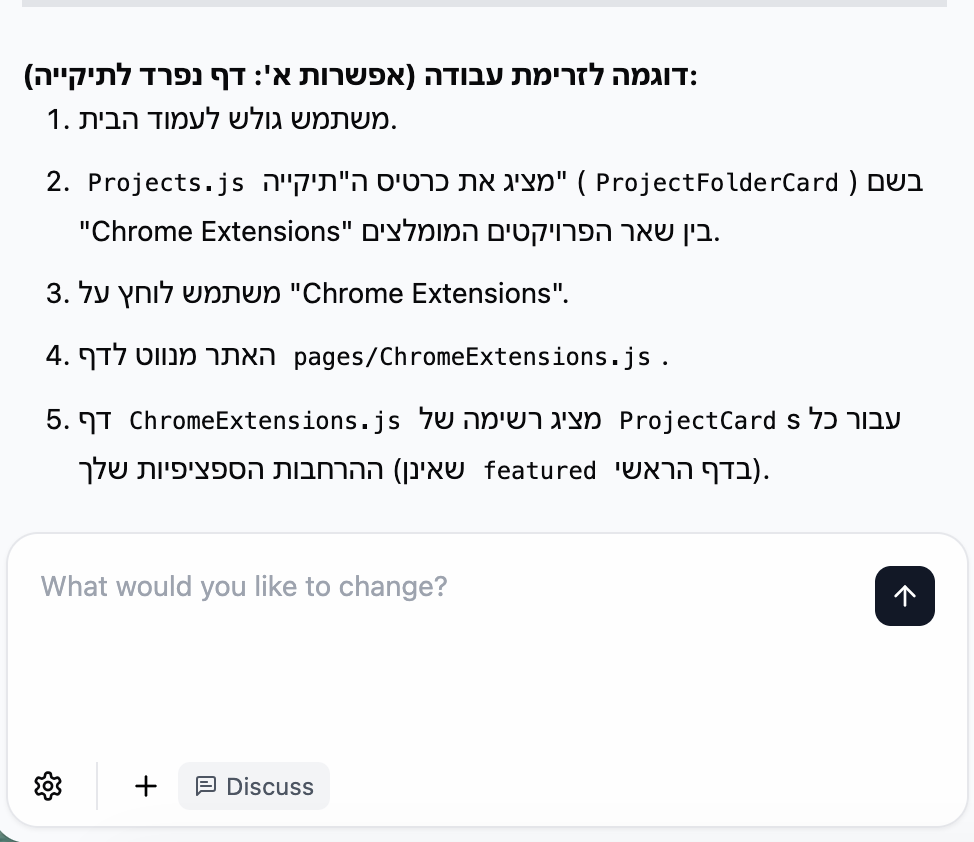
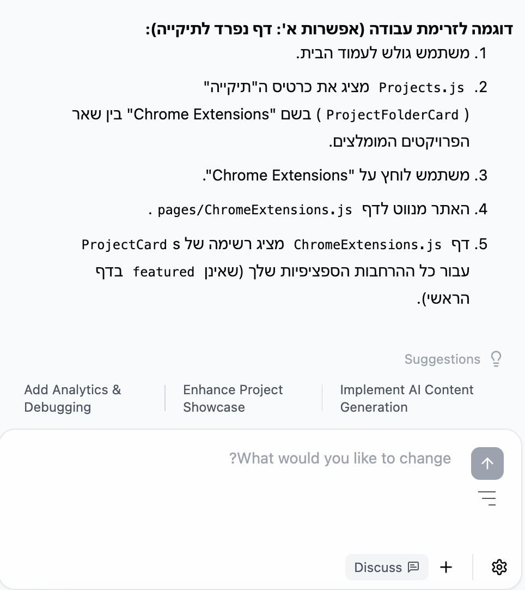

<div align="center">

# Base44 Chat RTL Toggle

[](https://opensource.org/licenses/MIT)
[](https://github.com/TzoharLary/base44-chat-rtl-toggle)
[](https://chrome.google.com/webstore)

**A powerful Chrome extension that seamlessly adds RTL (Right-to-Left) / LTR (Left-to-Right) text direction toggle to Base44 chat applications, with smart code copy buttons and perfect list formatting.**

[Features](#features) • [Demo](#demo) • [Installation](#installation) • [Usage](#usage) • [Contributing](#contributing)

</div>

---

## 📋 Table of Contents

- [Demo](#demo)
- [Features](#features)
- [Before & After](#before--after)
- [Installation](#installation)
- [Usage](#usage)
- [Supported Domains](#supported-domains)
- [File Structure](#file-structure)
- [How It Works](#how-it-works)
- [Development](#development)
- [Browser Compatibility](#browser-compatibility)
- [Permissions](#permissions)
- [Privacy](#privacy)
- [Troubleshooting](#troubleshooting)
- [Contributing](#contributing)
- [License](#license)
- [Version History](#version-history)
- [Support](#support)

---

## 🎬 Demo


> **Note:** Add a GIF showing the RTL toggle in action, code copy feature, and list formatting improvements.

---

## ✨ Features

### 🔄 **RTL/LTR Toggle**
- ✅ **One-click toggle** between Right-to-Left and Left-to-Right text directions
- ✅ **Persistent settings** - Your preference is saved and restored across sessions
- ✅ **Smart positioning** - The toggle button automatically positions itself near the send button
- ✅ **Visual feedback** - Icon flips to indicate current mode (RTL vs LTR)

### 📋 **Code Block Enhancements**
- 🚀 **Copy buttons** automatically appear on hover over code blocks
- 🚀 **Visual confirmation** with checkmark feedback when code is copied
- 🚀 **Proper LTR handling** - Code blocks remain left-to-right even in RTL mode

### 📝 **List Formatting**
- ⚡ **Fixed list alignment** - Bullets and numbers display correctly in RTL mode
- ⚡ **Natural indentation** - Lists maintain proper spacing and hierarchy

### 🛡️ **Technical Excellence**
- 💎 **Shadow DOM isolation** - Styles are completely isolated from the page
- 💎 **Automatic positioning** - Button repositions on window resize and scroll
- 💎 **Zero conflicts** - Won't interfere with existing page functionality

---

## 🔄 Before & After

<table>
<tr>
<th>Before (Without Extension)</th>
<th>After (With Extension)</th>
</tr>
<tr>
<td>
  


**Issues:**
- ❌ Text direction issues
- ❌ Lists poorly aligned
- ❌ No easy code copying
- ❌ Manual text formatting needed

</td>
<td>



**Fixed:**
- ✅ Perfect RTL/LTR toggle
- ✅ Properly aligned lists
- ✅ One-click code copying
- ✅ Seamless text direction

</td>
</tr>
</table>

> **Note:** Add screenshots showing the difference between text without and with the extension enabled.

---

## 📦 Installation

### Method 1: Chrome Web Store (Recommended)

1. Visit the [Chrome Web Store page](https://chrome.google.com/webstore) (Coming soon)
2. Click **"Add to Chrome"**
3. Confirm by clicking **"Add extension"**
4. Done! Visit any Base44 chat to see the toggle button

### Method 2: Install from Source

**Step 1:** Download or clone this repository
```bash
git clone https://github.com/TzoharLary/base44-chat-rtl-toggle.git
```

**Step 2:** Open Chrome Extensions page
- Navigate to `chrome://extensions/`
- Enable **"Developer mode"** (toggle in top right corner)

**Step 3:** Load the extension
- Click **"Load unpacked"**
- Select the extension directory you just downloaded

**Step 4:** Verify installation
- Visit a Base44 chat page (e.g., `app.base44.com`)
- Look for the toggle button near the send button
- Click it to test RTL/LTR switching

---

## 🚀 Usage

### Toggle Text Direction

**Step 1:** Open any Base44 chat interface

**Step 2:** Locate the RTL/LTR toggle button
- The button appears near the send button
- It features a minimal, clean icon design

**Step 3:** Click to toggle
- Click once to switch between RTL and LTR modes
- The icon flips to show the current mode
- Your preference is **automatically saved** for future sessions

### Copy Code Blocks

**Step 1:** Hover over any code block in the chat
- A copy button (📋) appears in the top-right corner

**Step 2:** Click the copy button
- Code is instantly copied to your clipboard
- A checkmark (✓) appears to confirm success

**Step 3:** Paste anywhere
- Use `Ctrl+V` (or `Cmd+V` on Mac) to paste

---

## Supported Domains

This extension works on the following Base44 domains:
- `app.base44.com`
- `*.base44.app`
- `*.base44.dev`
- `*.base44.io`

## File Structure

```
.
├── manifest.json        # Extension configuration
├── content.js          # Main functionality and logic
├── button_styles.css   # Isolated button styles (Shadow DOM)
├── page_styles.css     # Page-level text direction styles
└── README.md           # This file
```

## How It Works

### Architecture

- **Shadow DOM**: The toggle button uses Shadow DOM for complete style isolation
- **MutationObserver**: Automatically detects new chat messages and code blocks
- **ResizeObserver**: Keeps the button positioned correctly
- **Chrome Storage API**: Persists user preferences

### Key Components

1. **Toggle Button** (`content.js`)
   - Dynamically created with Shadow DOM
   - SVG icon that flips based on mode
   - Smart positioning near send button

2. **Text Direction** (`page_styles.css`)
   - Applies RTL/LTR to chat messages
   - Maintains LTR for code blocks
   - Fixes list alignment

3. **Copy Functionality** (`content.js`)
   - Injects copy buttons into code blocks
   - Clipboard API integration
   - Visual feedback system

## Development

### Customizing the Toggle Icon

Edit the icon variables in `content.js`:

```javascript
const ICON_STROKE_WIDTH = 1;
const ICON_MAX_WIDTH = 16;
const ICON_HEIGHT = 14;
const ICON_LINE_1_WIDTH = 16;
const ICON_LINE_2_WIDTH = 12;
const ICON_LINE_3_WIDTH = 6;
```

### Modifying Button Styles

Edit `button_styles.css` to change the button appearance:

```css
.b44-rtl-toggle-inner {
  border-radius: 6px;
  /* Add your custom styles */
}
```

### Adjusting Text Direction Rules

Modify `page_styles.css` to customize text direction behavior:

```css
.b44-chat-root.b44-chat-rtl {
  direction: rtl !important;
}
```

## Browser Compatibility

- **Chrome**: Version 88+ (Manifest V3 support required)
- **Edge**: Version 88+ (Chromium-based)
- **Brave**: Latest version
- **Other Chromium browsers**: Should work with Manifest V3 support

## Permissions

This extension requires:

- **storage**: To save your RTL/LTR preference
- **host_permissions**: To inject functionality into Base44 domains

## Privacy

- **No data collection**: This extension does not collect or transmit any user data
- **Local storage only**: Preferences are stored locally on your device
- **No external connections**: All functionality is client-side

## Troubleshooting

### Button not appearing
- Refresh the page
- Check that you're on a supported Base44 domain
- Ensure the extension is enabled in `chrome://extensions/`

### Toggle not working
- Clear browser cache
- Reload the extension
- Check browser console for errors

### Code copy not working
- Ensure clipboard permissions are granted
- Try refreshing the page
- Check that the code block has the proper class structure

## 🤝 Contributing

Contributions, issues, and feature requests are welcome!

**How to contribute:**

1. **Fork** the repository
2. **Create** your feature branch
   ```bash
   git checkout -b feature/amazing-feature
   ```
3. **Commit** your changes
   ```bash
   git commit -m 'Add amazing feature'
   ```
4. **Push** to the branch
   ```bash
   git push origin feature/amazing-feature
   ```
5. **Open** a Pull Request

Feel free to check the [issues page](https://github.com/TzoharLary/base44-chat-rtl-toggle/issues) for open issues or create a new one.

---

## 📄 License

This project is licensed under the **MIT License** - see the [LICENSE](LICENSE) file for details.

```
MIT License - Copyright (c) 2025 TzoharLary
```

---

## Version History

### v2.1.0 (Current)
- Shadow DOM implementation for complete style isolation
- Added code block copy buttons
- Fixed list alignment in RTL mode
- Improved button positioning stability
- Enhanced visual feedback

### Earlier Versions
- Basic RTL/LTR toggle functionality
- Initial code block handling

## Credits

Developed for use with Base44 chat applications.

## 💬 Support

If you encounter any issues or have suggestions:

1. 📖 Check the [Issues](https://github.com/TzoharLary/base44-chat-rtl-toggle/issues) page
2. 🐛 Create a new issue with:
   - Detailed description
   - Browser version
   - Steps to reproduce
3. 💡 Or start a [Discussion](https://github.com/TzoharLary/base44-chat-rtl-toggle/discussions)

---

<div align="center">

**⭐ If you find this extension helpful, please consider giving it a star!**

Made with ❤️ for the Base44 community

[Report Bug](https://github.com/TzoharLary/base44-chat-rtl-toggle/issues) • [Request Feature](https://github.com/TzoharLary/base44-chat-rtl-toggle/issues)

</div>
